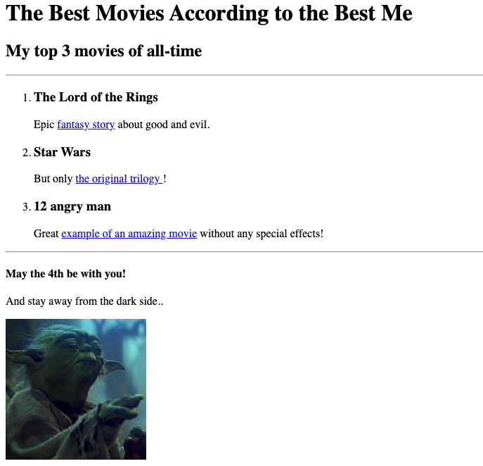

<!DOCTYPE html>
<html lang="en">
    
    <head>
        <meta charset="UTF-8">
        <title>DF Porfolio</title>
    </head>

    <body>
        <h1>DF's Portfolio</h1>
        <h2>I'm the Best Web Developer in the world!</h2>
        

            <a href="./public/movie-ranking.html"><h3>Movie Ranking Project</h3></a>
            
        

        <a href="./public/birthday-invite.html"><h3>Birthday Invite Project</h3></a>
            
        

        <a href="./public/about.html">About me </a>
        <a href="./public/contact.html">Contact me </a>
    </body>

</html>
